#### These procedure steps will be followed on the simulator

1. When you click on Sulphate in Water simulation file, a new window will open as shown below, hover on "Description" and "Solutions used" label to understand the terminologies and reagents used in the experiment. Click on NEXT button at the bottom right corner to move to next step. 
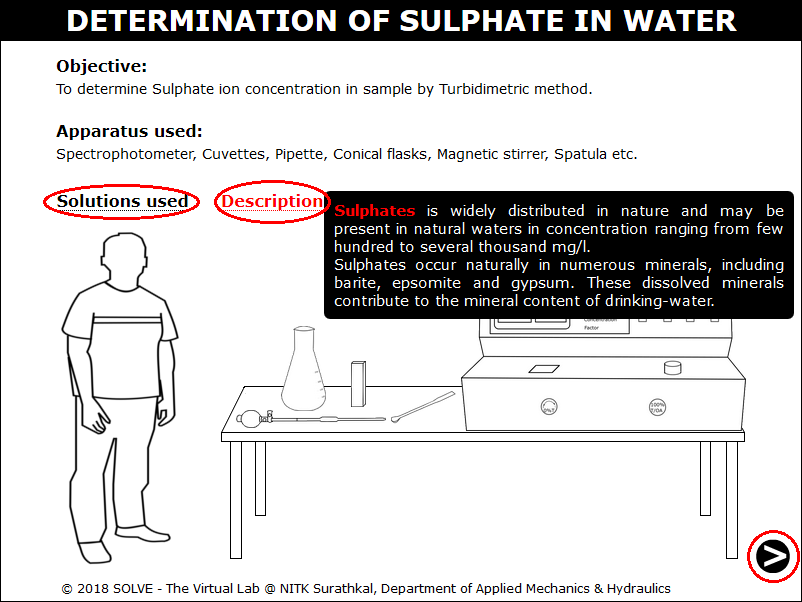 

2. Click on the pipette to take 5 to 40mg/l of standard Sulphate solution in conical flask. 
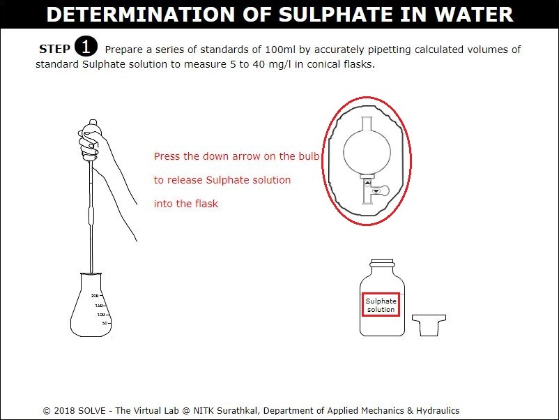 

3. Click on arrow points to add distilled water to conical flask. 
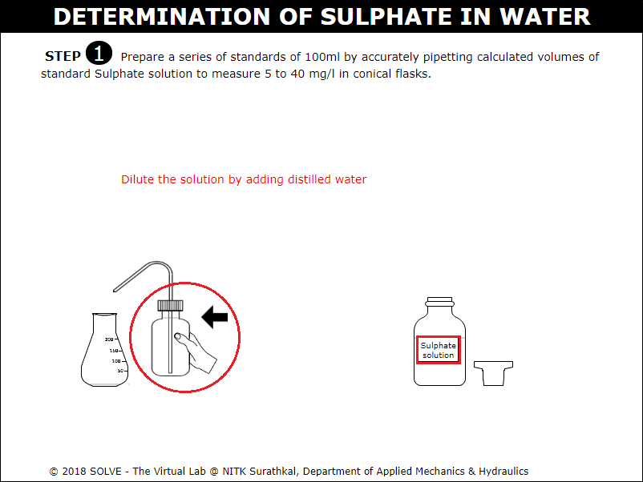 

4. Repeat the above steps to prepare series of standard solutions. Go through the instruction given click OK to proceed with the simulation. 
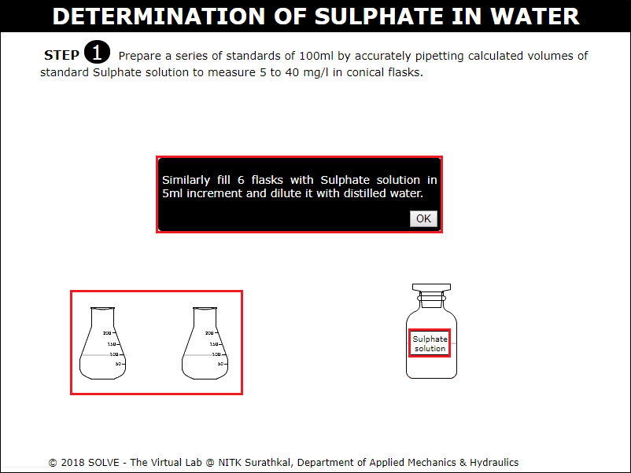 

5. Click on arrow points of graduated pipette to add 100ml of distilled water in order to prepare blank solution. 
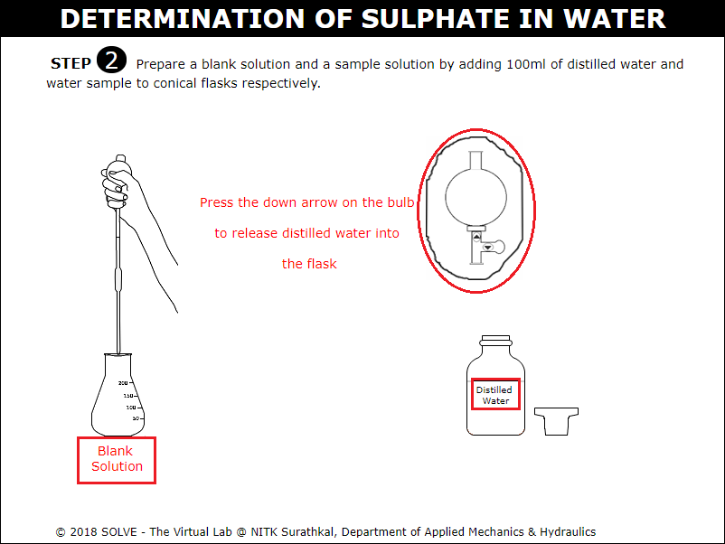 

6. Click on arrow points of graduated pipette to add 100ml of distilled water in order to prepare sample solution. 
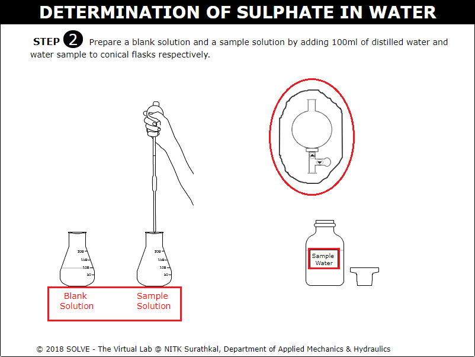 

7. Click on arrow points of graduated pipette to add 20ml of the Buffer solution to conical flask. 
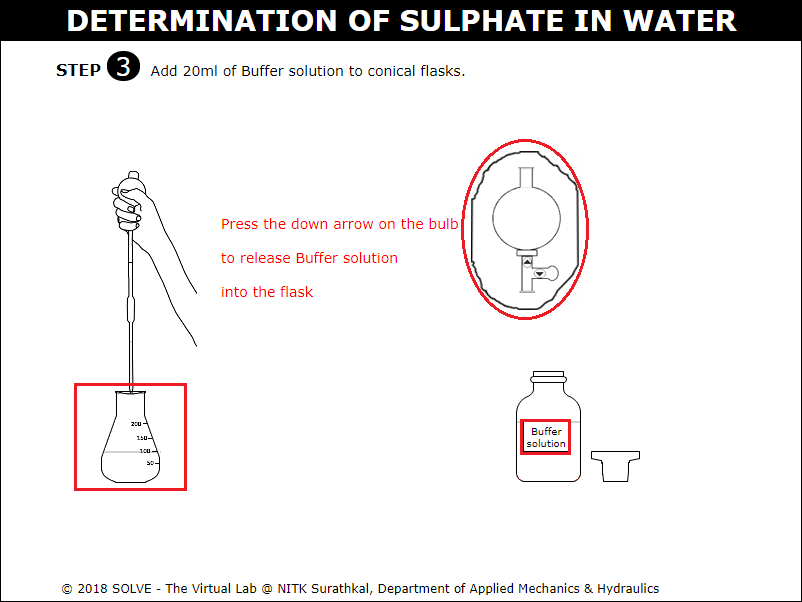 

8. Click on arrow points to add stir bar to the conical flask and on the magnetic stirrer to stir the solution similarly repeat the stirring of solution in conical flask for all the flask. 
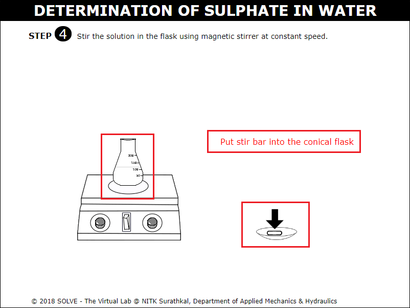 

9. Answer the question by selecting the correct answer to proceed with the simulation. 
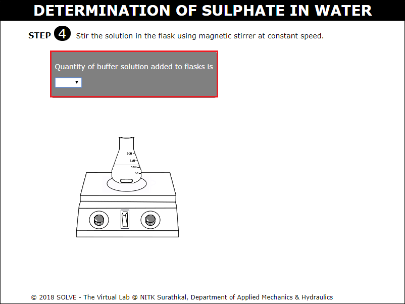 

10. Click on spatula to add 1 spatula of Barium Chloride crystals stir it for 60-65sec and allow it to rest. 
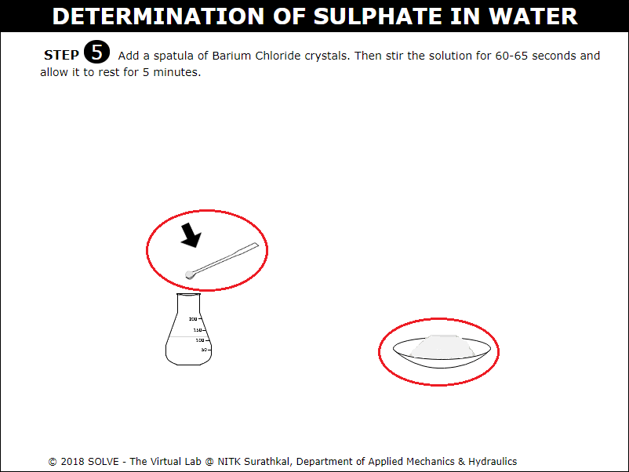 

11. Fill the cuvette with blank solution. 
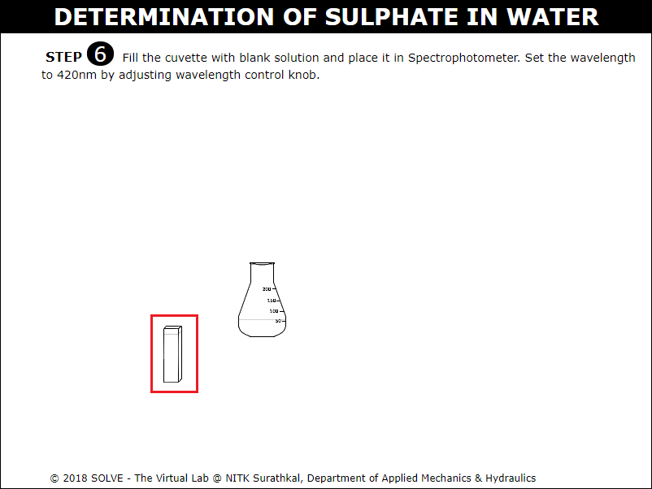 

12. Click on the Spectrophotometer to ON it. Turn the knob to adjust the wavelength to 420nm and place the blank solution in Spectrophotometer and determine the data of blank solution. 
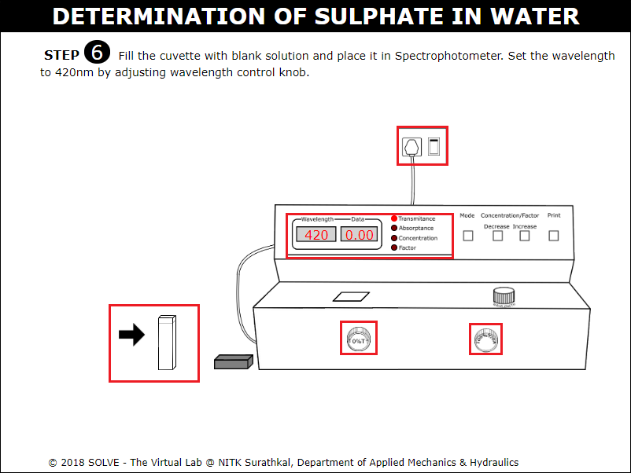 

13. Fill the cuvette with Sulphate solution and place in the Spectrophotometer and note down absorbance and transmittance values for all solutions. 
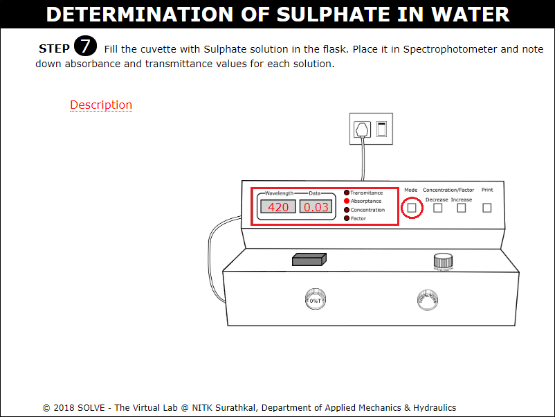 

14. Note down the absorbance and transmittance values for all solutions. Click on NEXT button to proceed. 
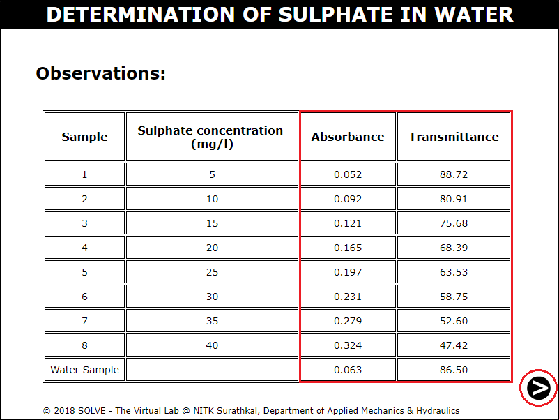 

15. Click on label to view graph and calculate the Sulphate concentration of tap water and water sample. 
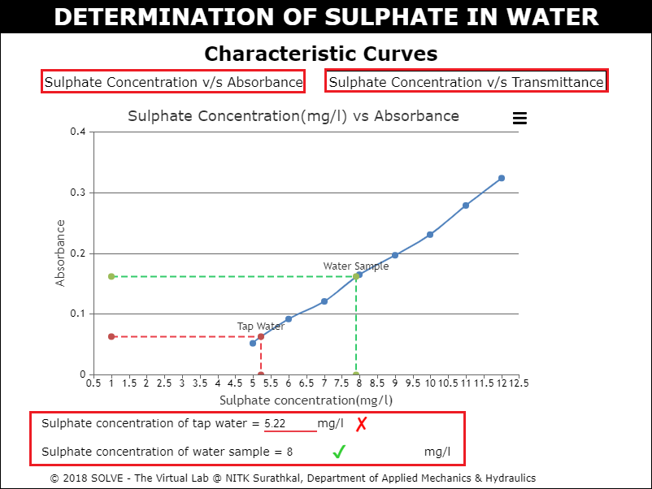 
